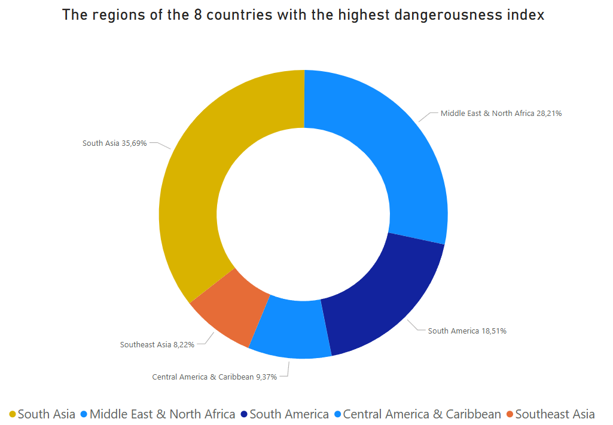
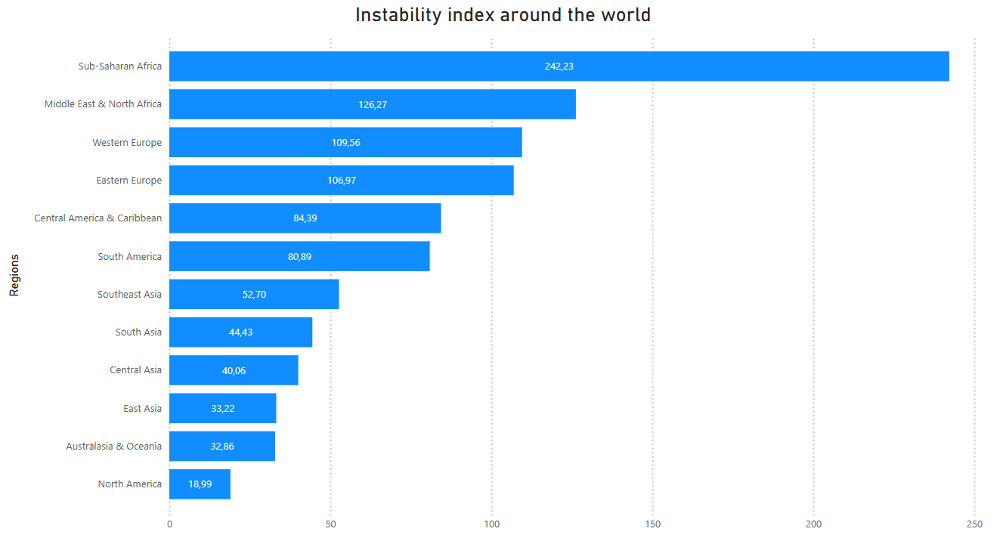
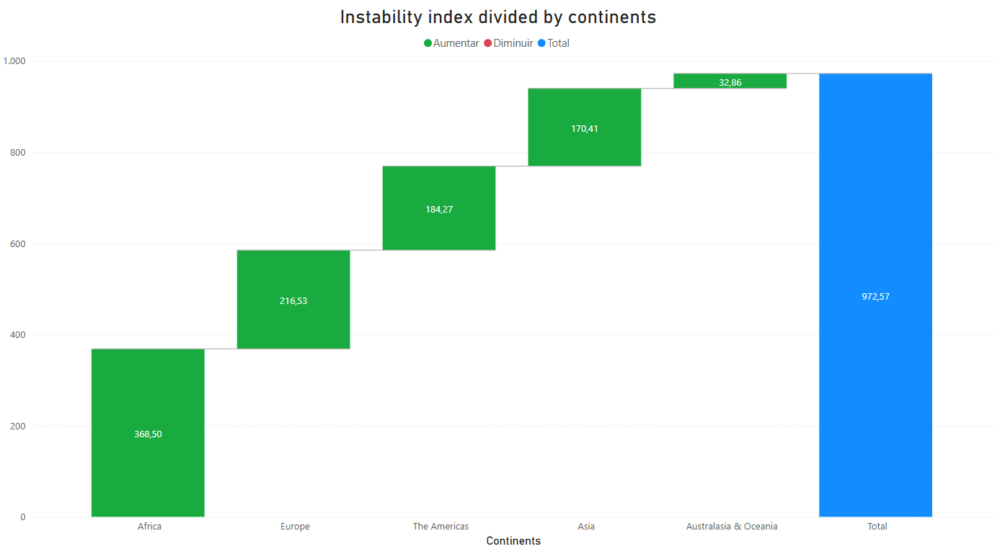

This project also has a portuguese version: :brazil: [Leia em Português](docs/README-PT-BR.md)

# 🌍 Terrorist Attacks Around the World

This project uses the [Global Terrorism Dataset (GTD)](https://www.kaggle.com/datasets/START-UMD/gtd) for **study**, **documentation**, and **technical skill demonstration** in **SQL, Python, and Power BI**. Although it's a personal project, it is structured as a public portfolio.

---

## Summary
1. [Project Objectives](#-project-objectives)
2. [Structure](#-structure)

    2.1 [Branches](#-branches)

    2.2 [Directories](#-directories)
3. [SQL Challenges Content](#-sql-challenges-content)
   
    3.1 [Challenges](sql/DISCLAIMER.md)
4. [Dashboards](#-dashboards)
5. [Disclaimers](#-disclaimers) and [Contact](#-contact)
6. [Tanks](#if-you-get-here)

---

## 🎯 Objectives

- Complete **50 SQL challenges**, divided by difficulty levels, based on a customized version of the GTD dataset;
- Create a **Python ETL pipeline** for data manipulation and export;
- Build **Power BI dashboards** for interactive data visualization;
- Apply best practices in version control using **Git and GitHub**.

---

## 🌿 Structure

### 🚀 Branches

This project follows a workflow organized by functionality:

| Branch | Purpose |
|-|-|
| `scripts` | Python scripts for ETL, database connection, exports, etc. |
| `sql` | SQL queries |
| `dashboards` | Images, `.pbix` files, and other visual outputs |
| `stage` | Intermediate integration of all resources before merging into `main` |
| `main` | Final and stable version, ready for public presentation on GitHub |

### 📁 Directories
```
/csv                # CSVs extracted via script
/dashboards         # Power BI (.pbix) files
/docs               # Documents used to build the dataset or related info
/images             # Supporting images
/scripts            # Python scripts (ETL, connections, helpers)
/sql                # SQL queries (numbered challenges)
/tools              # Internal project management and versioning scripts/docs
.env.example        # Sensitive data handling for version control
.gitignore          # Files/folders hidden on GitHub
README.md           # You are here!
.requirements.txt   # Requirements to run this project locally
```

---

## 🧠 SQL Challenges Content
The challenges are organized by difficulty level, ranging from basic to advanced. The last 20 questions are completely in english. If you want to see them in more detail, click [here](sql/DISCLAIMER.md) to go directly to the page with all the questions.

---

## 📊 Dashboards
Examples of dashboards created in Power BI:

### Challenge 30: Dangerousness Index
For each country, a "Dangerousness Index" was calculated by dividing the total number of recorded attacks since 1970 by the product of the variety of weapons used and the variety of attack types. This metric measures how "dangerous" a country is in terms of terrorism attacks, regardless of targets, perpetrators, or methods used. The image shows the regions of the 8 countries with the highest Dangerousness Index around the world.



### Challenge 41: Instability Index
For each region in the world, an "Instability Index" was calculated, based on the product of the total number of different attack types per country and the average fractional success rate of attacks in the region. This ranking contrasts with the previous table: while the top regions remain similar, some European regions now appear among the top 5, showing that these are not mirrored metrics and that the attack success rate may play a decisive role in this new ranking.



When grouped by continent, African regions remain in the lead, but Europe takes second place, followed by the Americas, Asia and Oceania.



---

## 📌 Disclaimers
1) This project is educational and has no commercial purpose. The analyses were based on public data from the site [Kaggle](https://www.kaggle.com/datasets/) and are intended to demonstrate technical skills.
2) If you wish, you can download the documents I used for this project, including the PDFs. Everything is available in the `.rar` file in [docs](docs), including the adapted table CSVs for this project.

## 📬 Contact
You'll find all my contacts in the `README` of my GitHub profile: [github.com/jaxolv](https://github.com/jaxolv)

---

## If you get here:
Thank you so much for your time and attention.

Feel free to get in touch!

