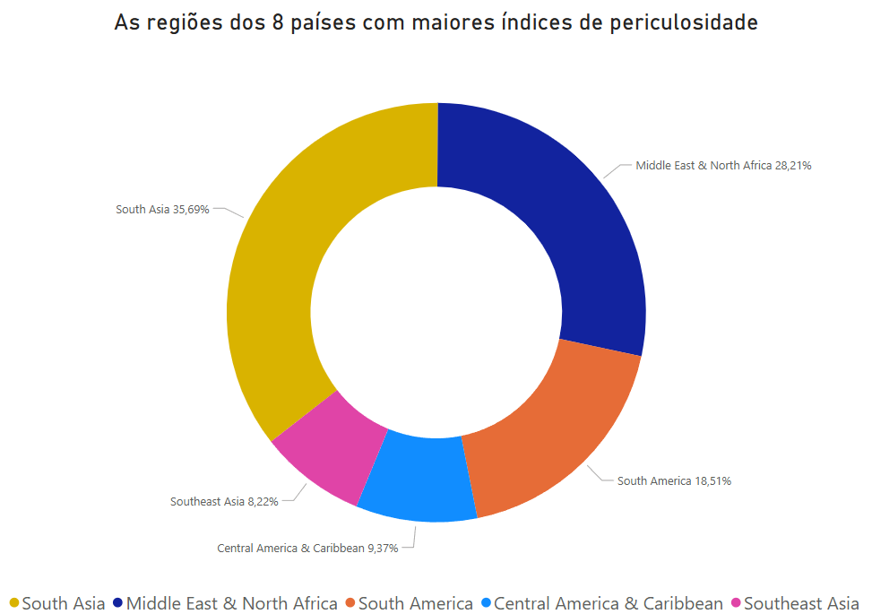
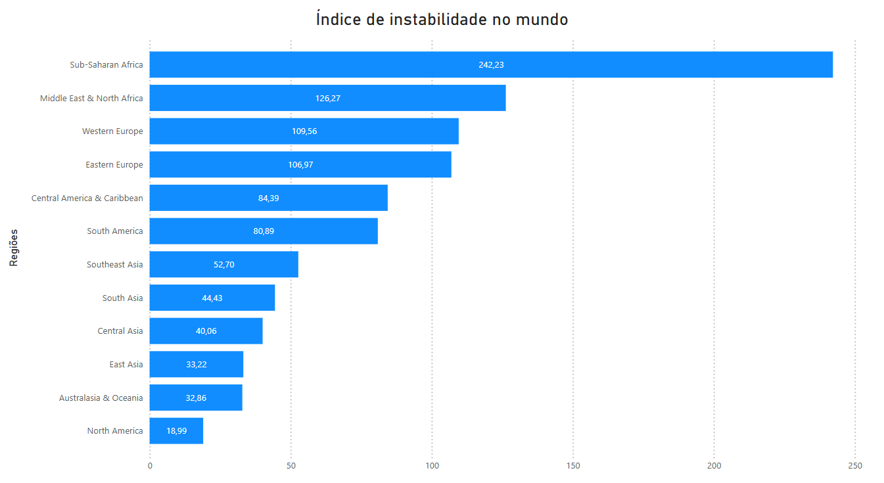
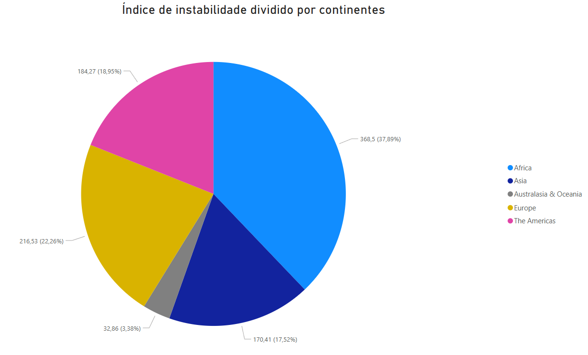

# 🌍 Atentados Terroristas ao Redor do Mundo

Este projeto utiliza o dataset [Global Terrorism (GTD)](https://www.kaggle.com/datasets/START-UMD/gtd) para fins de **estudo**, **documentação** e **demonstração de habilidades técnicas** em **SQL, Python e Power BI**. Trata-se de um projeto pessoal, mas estruturado para servir de portfólio público.

---

## Sumário
1. [Objetivos do Projeto](#-objetivos-do-projeto)
2. [Estrutura de Branches](#-estrutura-de-branches)
3. [Estrutura de Diretórios](#-estrutura-de-diretórios)
4. [Conteúdo dos Desafios SQL](#-conteúdo-dos-desafios-sql)
   
    4.1 [Desafios](sql/DESAFIOS.md)
6. [Dashboards](#-dashboards)
7. [Avisos](#-avisos) e [contatos](#-contato)
8. [Agradecimentos](#se-leu-até-aqui)

---

## 🎯 Objetivos do Projeto

- Realizar **50 desafios de SQL**, divididos em níveis de dificuldade, a partir de uma adaptação que fiz da base GTD;
- Criar um pipeline de **ETL em Python** para manipulação e exportação dos dados;
- Construir **dashboards em Power BI** para visualização interativa;
- Utilizar boas práticas de versionamento com **Git e GitHub**.

---

## 🚀 Estrutura de Branches

Este projeto segue um fluxo de trabalho organizado por funcionalidades:

| Branch | Função |
|-|-|
| `scripts` | Scripts Python de ETL, conexão com banco, exportações, etc. |
| `sql` | Consultas SQL |
| `dashboards` | Imagens, arquivos `.pbix` e outras saídas visuais |
| `stage` | Integração intermediária de todos os recursos antes da `main` |
| `main` | Versão final e estável, pronta para apresentação no GitHub |

---

## 📁 Estrutura de Diretórios
```
/csv                # CSVs extraídos via script
/dashboards         # Arquivos .pbix do Power BI
/docs               # Documentos usados para criar o dataset ou informações relacionadas
/images             # Imagens auxiliares
/scripts            # Scripts em Python (ETL, conexões, helpers)
/sql                # Consultas SQL (desafios enumerados)
/tools              # Documentos e scripts técnicos para gerenciamento interno do projeto e versionamento
.env.example        # Tratativa de dados sensíveis para versionamento
.gitignore          # Arquivos/pastas ocultas no GitHub
README.md           # Você está aqui! 
.requirements.txt   # Requisitos para execução desse projeto em máquina local
```

---

## 🧠 Conteúdo dos Desafios SQL
Os desafios foram organizados em níveis de dificuldade, indo do mais básico ao mais avançado. Caso queira ver com mais detalhes, clique [aqui](sql/DESAFIOS.md) para ir diretamente à página contendo todas as questões.

---

## 📊 Dashboards
Abaixo serão adicionadas imagens de dashboards criados no Power BI como exemplo.

### Questão 30: Índice de Periculosidade
Para cada país, foi calculado o "Índice de Periculosidade", onde foi dividido o número total de ataques registrados desde 1970 pelo produto entre variedade de armas usadas e variedade de ataques. Essa métrica mediria quão "perigoso" é um país em termos de atentados terroristas, independente dos seus alvos, quem planejou/executou ou métodos usados. Na imagem, têm-se as regiões ao redor do mundo dos 8 países com maiores Índices de Periculosidade.



### Questão 41: Índice de Instabilidade
Para cada região do mundo, foi encontrado o "Índice de Instabilidade", baseado no produto do número total de diferentes ataques por país pelo percentual fracionário médio de ataques bem-sucedidos na região. Esse número vai de encontro à tabela exibida anteriormente, já que nele podemos identificar que os primeiros lugares são as mesmas regiões, porém nota-se que agora outras regiões da Europa surgem entre os 5 primeiros, mostrando que não são métricas espelhadas entre si e que há indícios de que a taxa de sucessos dos ataques pode ser determinando para este ranking.



Quando agrupamos por continentes, vemos que regiões da África continuam à frente, mas a Europa assume o segundo lugar.



---

## 📌 Avisos
1) Este projeto é educacional e não possui fins comerciais. As análises foram produzidas com base em dados públicos do Kaggle, e servem como demonstração de habilidades técnicas.
2) Caso queira, você pode baixar os documentos que usei para este projeto, incluindo os desafios em PDF. Todos estão no arquivo `.rar` em [docs](docs), incluindo os CSVs das tabelas adaptadas para esse projeto.

## 📬 Contato
Você encontrará meus contatos no `README` do meu perfil aqui no Github: [github.com/jaxolv](https://github.com/jaxolv)

---

## Se leu até aqui:
Desde já, agradeço pela atenção.

Sigo à disposição para contato.
